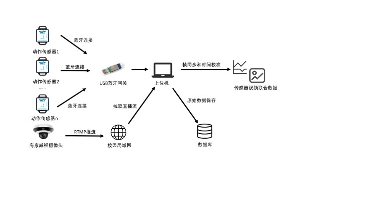

# 动作传感器&惯性传感器联合采集程序

## 简介
本程序使用java语言编写，传感器为WT901BLE5.0蓝牙九轴动作传感器，共4个。网关为WT52HB，可同时连接四个传感器。

程序框架设计如图所示

视频采集逻辑位于`src/main/java/org/xty/signal_capture/device/camera/RtmpCamera.java`，同时支持本地摄像头`AppleFaceTimeCamera`。

传感器采集逻辑位于`src/main/java/org/xty/signal_capture/device/bluetoothAdaptor/WT52HB.java`，具体通信协议见`docs`中的说明文档

## 运行

`src/main/java/org/xty/signal_capture/dao/DataSources.java`中可以配置对象存储（存图片）的地址和密码

`src/main/resources/mysql.properties`中配置了MySQL的用户名和密码，存储传感器帧

`org.xty.signal_capture.main.SyncCameraSerial.mainPipeline`中配置传感器的名称，摄像头api地址和key
配置完成后运行main方法进行录制